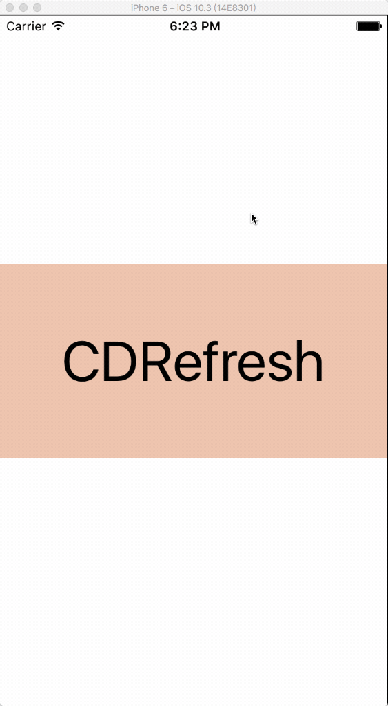

# CDRefresh
A simple horizontal refresh control.

一个简单易用的水平刷新控件，支持自动加载。结构简单可以根据自己需求进行定制，也为写一个属于自己的`Refresh`提供一个思路。

## How to use CDRefresh
* Manual import：
	* Drag All files in the `CDRefresh` folder to project
	* Import the main file：`#import "CDRefreshControl.h"`

## Usage
~~~objc
 _refreshControl = [[CDRefreshControl alloc] initWithScrollView:_scrollView];
    
[_refreshControl addTarget:self action:@selector(refresh) forControlEvents:CDRefreshEventsRefresh];
~~~

if you want end refresh just use like below:

~~~objc
[_refreshControl endLoading:NO];
~~~